<!-- The organisers' challenge description, from fips.fi. Kept as the authoritative
statement of the rules, the two scoring measures and the measurement protocol. -->

# Helsinki Asteroid Challenge 2026

The Finnish Inverse Problems Society (FIPS) proudly presents the Helsinki Asteroid Challenge 2026 (HAC 2026). We invite all scientists and research groups to test their reconstruction algorithms on our real-world data.

## About

### Introduction

Imagine looking at an asteroid using a telescope on planet Earth. The asteroid is so far away that it shows up just as a bright point. But the brightness of the point is changing with time. Why?

The asteroid rotates while being lit by the sun. Depending on its shape, a varying part of the surface is hit by light from time to time. For a perfectly spherical asteroid we would observe constant brightness when the angle between light source and observer is fixed. However, most asteroids are not spherical, and we can record changing brightness values as a function of time: this is called a lightcurve. Different shapes produce different lightcurves, depending also on the angles between three vectors:

1. direction of sunlight (assumed parallel-beam due to great distance),
2. our telescope’s optical axis,
3. asteroid’s axis of rotation.

And now we arrive at the inverse problem: given a collection of lightcurves measured using several combinations of vectors 1-3, can we recover the shape of the asteroid?

### Challenge

The purpose of the challenge is to recover the shapes of 3D targets from their lightcurves collected in the Industrial Mathematics Laboratory at the University of Helsinki, Finland. The experimental setup, targets, and measurement protocol are described in the following sections.

The outcome of the challenge should be an algorithm that produces a binary 3D volume reconstruction based on the following input:

1. lightcurve data,
2. metadata about the measurement geometry,
3. a priori information about the asteroid shape.

For three asteroid models, we publish all the data we have on them. These three models serve as examples of data and its unidealities.

In addition to the three public asteroid models, we publish lightcurve data on seven more asteroid models organized in increasing level of difficulty. Those models may or may not look like any real asteroid, and their shape becomes trickier to reconstruct as the level goes up. Also, we reduce the number of data published according to difficulty.

We will announce a special issue of Applied Mathematics for Modern Challenges for the participants to publish their results. 

## Rules

### Requirements of the competition

What needs to be submitted? Briefly, the algorithms must be shared with us as a private GitHub repository at latest on deadline. Check the relevant subsections for detailed instructions. Only submissions that fulfil the requirements listed below will be accepted.

The teams can submit more than one reconstruction algorithm to the challenge, however, each algorithm must be in a separate repository. The maximum number of algorithms is the number of members of the team. Your team do not need to register multiple times in case you decide to submit more than one algorithm to the challenge. The team can send a single email with the links to all the repositories.

After the deadline, there is a brief period during which we can troubleshoot the codes together with the competing teams. This is to ensure that we are able to run the codes. The troubleshoot communication is done mainly via ‘Issues’ section of the submitted repository, so pay attention to any activities in the repository after the deadline.

Special situations: The spirit of the competition is that the algorithm is a general-purpose algorithm, capable in principle of reconstructing any 3D shape from lightcurve data, including shapes not present in the competition. The organizing committee has the right to disqualify an algorithm trying to violate that spirit.

Conflict of interest: researchers affiliated with the Department of Mathematics and Statistics of University of Helsinki will not be added to the leaderboard and cannot win the competition. Same goes for the colleagues who visited us during the preparation of the challenge and saw the secret asteroid models (you know who you are :-).

### Submission of results

Check out the submission deadline from the “Deadlines” section.

You need to return the reconstructed objects as an .stl file. The orientation of the asteroid model must be as follows: the axis of rotation coincides with the $z$-axis, top of the model touches the $z=1$ plane and the bottom of the model touches the $z=-1$ plane. The light source is thought to be located at $(-\infty,0,0)$, and the asteroid should be in the same position as at the beginning of the lightcurves.

Also, you must provide a link to a private GitHub repository containing the codes. Later the repository should be made permanently public in order to win the challenge.

Competitors can update the contents of the shared repository as many times as needed before the deadline. We will consider only the latest release of your repository on Github.

The submission should be sent to hac2026(“at”)helsinki.fi.

More detailed instructions will follow.

### Scores and evaluation

We will measure the quality of reconstructions using a combination of two measures of fitting to the true object. The team wins who gets the highest sum of all scores over the 7 secret asteroid models (minimum score 0, maximum score 14).

- Voxel-based measure. Fit the true shape and reconstruction into the same bounding box. Compute the number of voxels of reconstruction that are also in the true shape, and the number of voxels in the reconstruction that are NOT in the true shape. The measure is $1 - (\#(A \setminus B) + \#(B \setminus A)) / (\#(A) + \#(B))$
- Side-view measure. Look at 2D projections along unspecified directions. We calculate the distance between two boundary curves.
- Both measures are normalized so that the values are between 0 and 1, zero being a bad match and 1 being the perfect match.
- We release later Python code for the voxel measure and Matlab code for the projection measure.

### Open science

Finally, the competitors must make their GitHub repositories public at latest on October 31, 2026. In the spirit of open science, only a public code can win HAC 2026.

## Data

### About the data

The challenge data consists of lightcurves corresponding to ten different 3D models, and some additional information. The directions of view and light for the lightcurves we collected are described in the section “Data collection set up”.

The additional information about the asteroid models is this. To avoid uniqueness issues, we describe a bounding cylinder. Assume that the object is located in $xyz$-space between planes $z=-1$ and $z=1$, and having a non-empty intersection with both of those planes. Consider the cylinder $D(0,R) \times [-1,1]$, where $D(0,R)$ is the disc in the $xy$-plane with center at the origin and radius $R>0$. We give the minimal radius $R>0$ that still contains the asteroid model inside the cylinder.

| Asteroid model | Cylinder base radius $R$ |
| --- | --- |
| Model 1 | 1.12 |
| Model 2 | 1.42 |
| Model 3 | 0.88 |
| Model 4 | 1.475 |
| Model 5 | 1.22 |
| Model 6 | 0.925 |
| Model 7 | 1.205 |
| Model 8 | 1.24 |
| Model 9 | 0.67 |
| Model 10 | 3.95 |

References related to reconstructing shapes from light curve data:

Muinonen, K., and K. Lumme. “Disk-integrated brightness of a Lommel-Seeliger scattering ellipsoidal asteroid.” Astronomy & Astrophysics 584 (2015): A23.
Kaasalainen, Mikko, and Johanna Torppa. “Optimization methods for asteroid lightcurve inversion: I. shape determination.” Icarus 153.1 (2001): 24-36.

Open software for reconstruction (note that it may not be easy to get them running):

[DAMIT Software Download](https://damit.cuni.cz/projects/damit/pages/software_download)
[ADAM (GitHub)](https://github.com/matvii/ADAM)
[xitau (GitHub)](https://github.com/miroslavbroz/xitau)

### Get the data

Due to excessive workload, we start by publishing data for four asteroid models only. Later we add more up to model 10. Make sure to register your team so we can contact you whenever more data is available.

You can download the data using this link.

To fetch it into this repo, run `make data` (see the README's "Getting the data" section). The Dropbox link is configured in `src/helsinki_challenge_2026/download_data.py` (or via the `HAC_DATA_URL` environment variable), and the data is extracted into `data/raw/`.

Three of them, asteroids 1-3, are our public models. For them we publish everything: shapes as .stl files, simulated videos along 21 selections of directions of view and directions of (parallel-beam) light, real-world videos measured in the laboratory, lightcurves from both simulated and measured data, size of the bounding cylinder. The lightcurves come in two different flavors: with and without thresholding the frame pixel values before integrating over the image. With asteroids 1-3 you can get to understand our data and the unidealities it contains.

Asteroid model 4 is the first challenge. For that one we publish all the lightcurves and the radius of the bounding cylinder.

Stay tuned for Asteroid models 5-10. As the challenge gets more difficult we might not publish the simulated lightcurves or all the available angles.

### Data format

We fix one point on each asteroid model; at the initial time of any lightcurve, that point faces the light source. Included are lightcurves computed from both real-world videos and Blender-simulated videos. For normalization, each individual lightcurve is divided by its mean value (separately for each individual lightcurve, not using the mean over all lightcurves). 

Format of lightcurves: text file describes matrix with 29 columns. The first column gives time stamps (or frame index). Columns 2,3,4,5 are for camera angle zero. Column 2 and 3 are with horizontal camera positions. Column 4 is top camera and column 5 is (virtual) bottom camera. Columns 6,7,8,9 are for camera angle 45°. The next for 90°, and so on. To understand the different cameras and the filming angles, please check out the section “Data collection set up”.

Note: The lightcurves start from the same position as the Blender-simulated videos, but the real-world videos do not necessarily start from the same position. We will also still change the focal length and distance in the Blender videos to better match the real-world measurements (We will inform of the update on the webpage News & Updates section).

For each asteroid we publish four lightcurve files: real-world data with and without thresholding, Blender simulated data with and without thresholding. (The simulated lightcurves might not be made available for all asteroid models until the end of the challenge.)

### Data collection setup

The challenge data was collected at the University of Helsinki. We set up a rotation stage with the possibility to fix different objects on. The objects were illuminated using a parallel beam light source. Two cameras were set up on tripods to record videos of the rotating objects from different angles.

We used two identical Canon 5D Mk IV cameras, one with a 100mm fixed focal length and the other with a 70-200mm zoom lens. The videos were recorded in Full HD (FHD) 1920×1080 pixel size and stored in .mp4 format.

Below is a sequence of diagrams that hopefully make it clear how we measured using two cameras, one horizontal and the other one looking downwards to the top of the asteroid model.

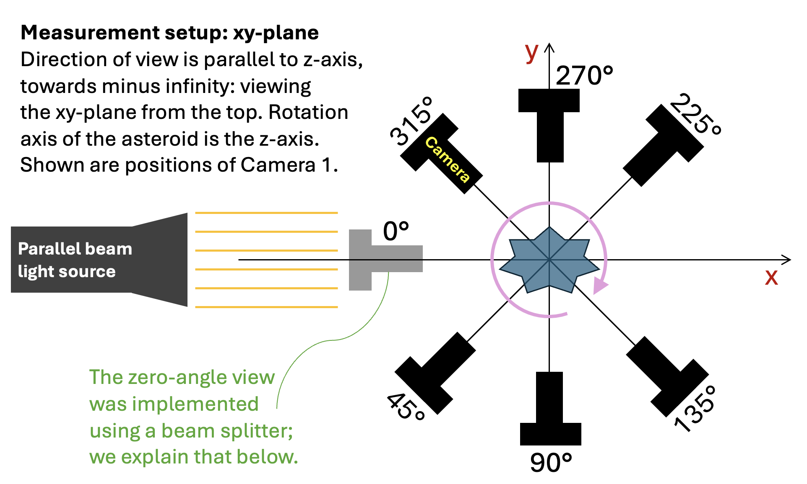
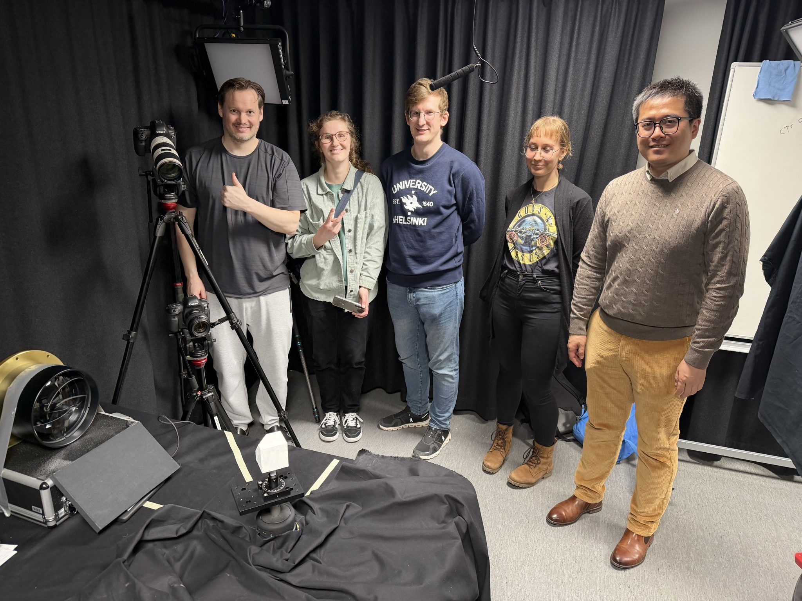
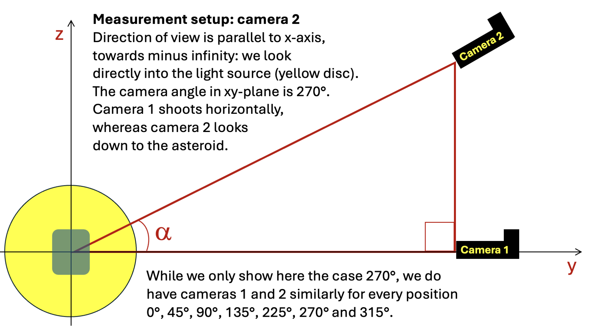

Top camera looked down at an angle $\alpha$ as shown in the image above. The angle varied slightly between measurements:

| Measurement angle | Top camera angle ($\alpha$) |
| --- | --- |
| 0° | 21° |
| 45° | 26° |
| 90° | 26° |
| 135° | 26° |
| 225° | 24° |
| 270° | 24° |
| 315° | 24° |

How did we do the zero angle? In the diagram the camera is in the way of the light. Well, we had to rely on a transparent mirror, often called a beam splitter.

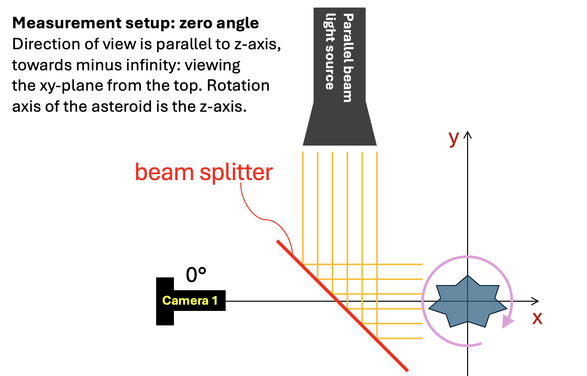
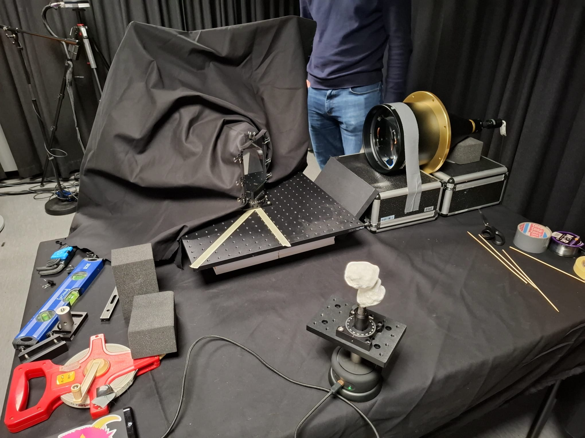

Also, we used a trick to allow a lightcurve view of the bottom side of the asteroid as well. We could not use a third camera located lower than the table and looking up because of the stem 3D printed to the asteroid model. We needed the stem for attaching the model to the rotation stage, but the stem would be visible in the video. Our solution to this problem is described in the diagrams below.

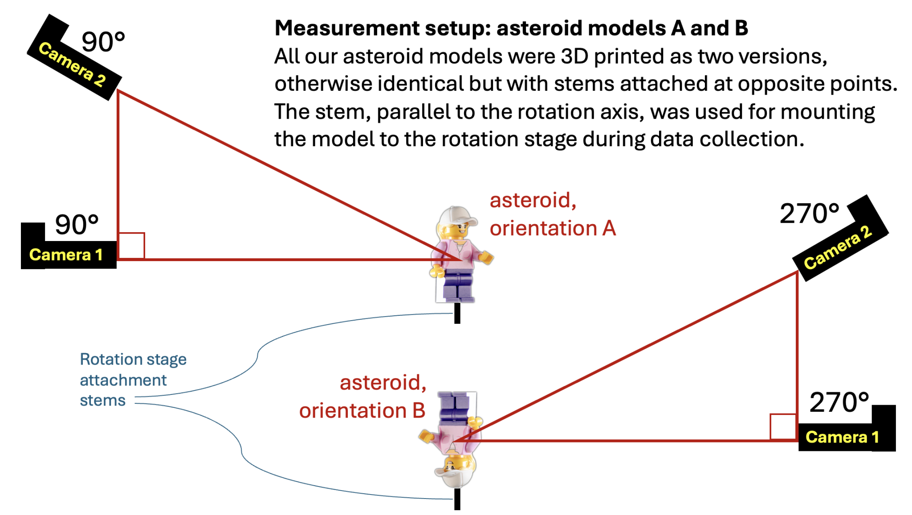
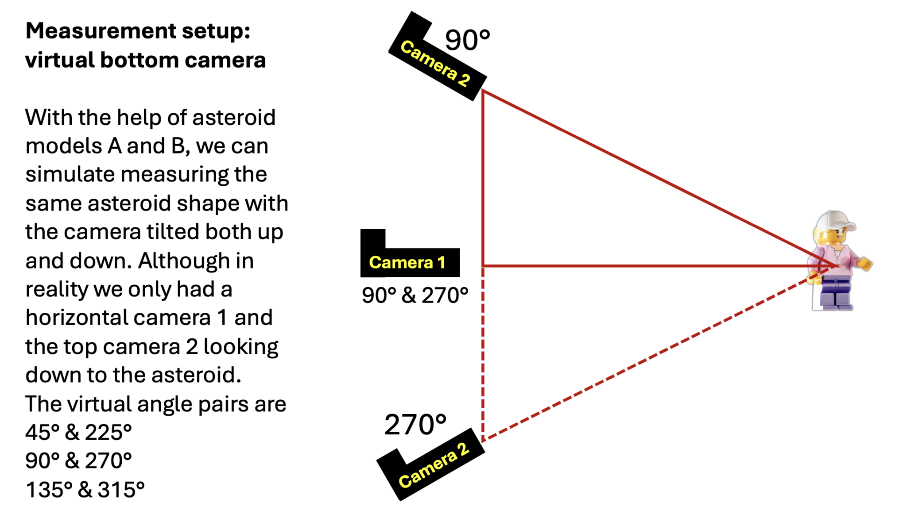

### Forming the lightcurves

For this challenge, we generate two types of lightcurves: binary curves and intensity curves. A binary curve is derived from a binary mask and represents the number of bright pixels in each video frame, whereas an intensity curve represents the total light intensity reflected by the asteroid. In practice, the only difference between these two curve types lies in the thresholding step, which is described next. 

The generation of lightcurve data from the videos consists of three main steps: thresholding, rotation detection, and curve matching. Next we explain each of the three steps in detail.

Thresholding. The purpose of this step is to generate the initial lightcurve data from the videos, representing the light reflected from the object toward the cameras at each frame. To achieve this, thresholding is applied to distinguish background pixels from pixels containing reflected light. 

For binary curves, the threshold is determined from the first video frame using Otsu’s method. In short, Otsu’s method analyzes the grayscale histogram of the image and selects the threshold that maximizes the variance between two classes (dark and bright pixels), which is equivalent to minimizing the variance within each class. 

For intensity curves, a fixed threshold value is used, chosen to be significantly lower than the threshold obtained by Otsu’s method. This ensures that darker gray pixels are also included, allowing the full reflected light intensity of the asteroid to be captured. 

A summary of these thresholding approaches is illustrated in the figures below. 

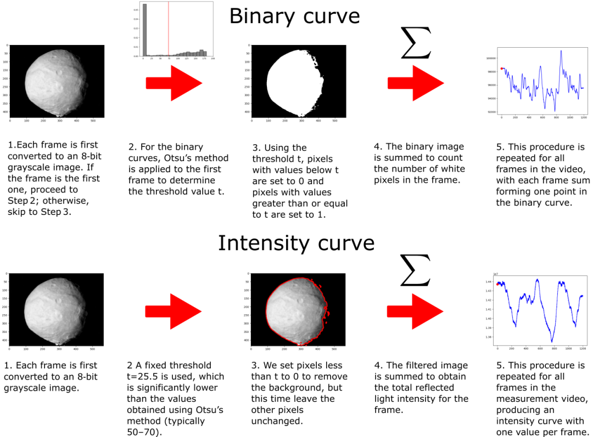

Finding the rotation. Each lightcurve should represent one full rotation of the asteroid. To ensure that a complete and consistent rotation is captured, the recordings extend slightly beyond a single rotation period. Therefore, a method is required to extract one full 360° rotation from the measured curve. 

Our approach for identifying this rotation segment is described below. 

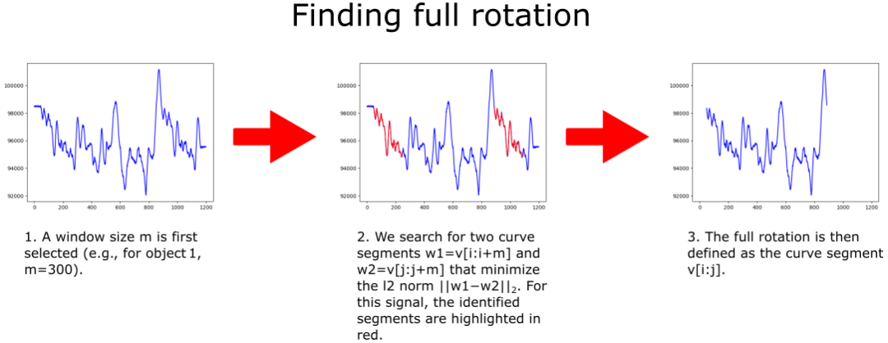

Matching the curves. The final step in generating the lightcurve data is to align the curves so that they all start from a common initial point. Before matching, each curve is normalized by dividing it by its mean value. This normalization is performed separately for each individual lightcurve. 

As described in the data collection section, two cameras were used: one horizontal camera and one camera viewing the asteroid from above. These cameras are time‑synchronized using the original audio track. In addition, two orientations of the same asteroid model were used (A and B), allowing us to simulate observations from below. Consequently, the curves corresponding to the virtual angle pairs 45° & 225°, 90° & 270°, and 135° & 315° must be matched (e.g., 45° in orientation A with 225° in orientation B). 

Since the two cameras are already synchronized, it is sufficient to match the curves obtained from the horizontal camera (camera 1). These curves should be approximately identical, up to a time reversal and a temporal shift. 

The curve‑matching procedure for the horizontal camera data is described below. 

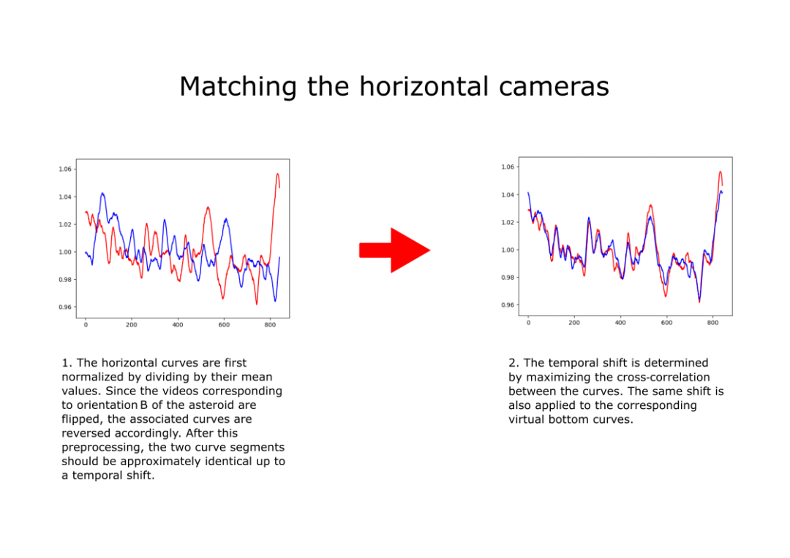

The final step is to align the real data curves with the simulated Blender curves. Since the Blender videos contain 360 frames per rotation, while the real data curves consist of more than 800 frames, we first use linear interpolation to resample the real data onto the 360‑frame Blender grid. The temporal shift between the interpolated real data curve and the simulated Blender curve is then determined by maximizing their cross‑correlation. Finally, this shift is mapped back to the original real data coordinates and applied accordingly. A visual illustration of this procedure is shown below. 

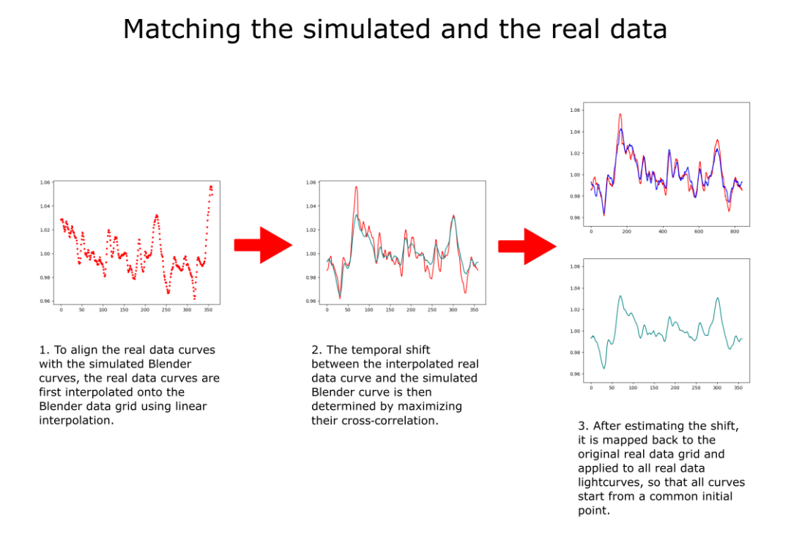

## Q and A

Q: Is the challenge open for teams outside Finland?

A: The challenge is open to everyone and we welcome submissions from all over the world! (Teams from the Department of Mathematics and Statistics of University of Helsinki are also free to submit their algorithms, but will not be ranked.)

Q: How are the 1D light curves computed – just the sum of the pixels on the frame? Dark pixels ouside the illuminated model contributed with some (negligible?) background signal or were they set to zero?

A: We will add the description of light curve computation in the data section soon. In short, we thresholded small values to zero and then summed the pixels on the frame. (There is also the “binary thresholding” alternative; there we had a larger threshold to zero and applied Otsu’s method.)

Q: And what about the blender light curves? The cube model shows that the projection is not ortographic, quite different from the real lab video. Does the projection play any role in the way blender computes the light curve?

A: We recognised this issue as well. The Blender curves are not as good a match to the real data with this projection. The Blender curves will be re-computed in the near future with the virtual camera placed farther away from the asteroid. 

Q: Is the material of the asteroids >=4 the same as for models 1-3? If the material was the same, one could use the known shapes to determine the scattering model and then use it for unknown shapes.

A: All 10 asteroid models are coated in the same way: applying filler to smoothen out tiny grooves from 3D printing and then spray painting the models with matte white paint. The idea is that the three first (public) models help interpret the light curves of the secret models. 
